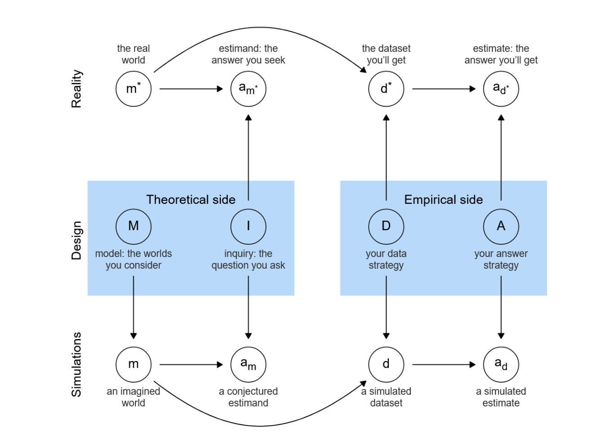
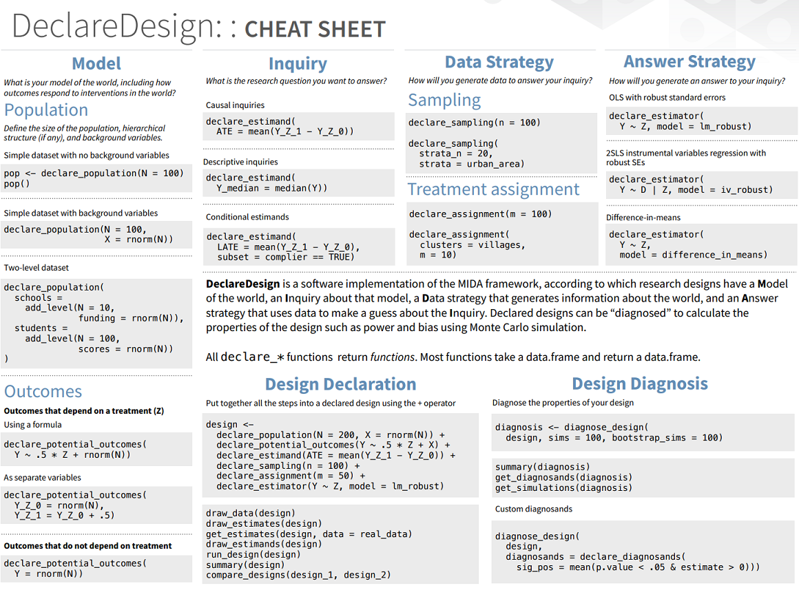

# Today


::: {.cell}

:::


1. Intros
2. Lecture
3. Individual work
4. Discussion
5. Perhaps: DD deeper dive

# Lecture outline

* General aims and structure
* Expectations
* Pointers for coding
* Topics / refreshers
  * Papers: structures and processes
  * DAGs, variables, identification strategies
  * Designs and design diagnosis


## Aims

* Write a paper
* Follow open science principles


## Expectations {.smaller}


1. Introduction (today!)
    1. Task: Describe the design informally in MIDA terms
    2. Task: Identify relevant literature and a model article
2. Design
   1. Task: Read one piece from relevant literature of at least 2 classmates 
   2. Task: Formally "declare" the design, present the declaration
   3. Task: Situate the contribution, present the contribution
3. Writing from inside out
   1. Task: *Before class*: Only if relevant for your project: register the design before implementing analysis. This is not relevant if you have already implemented analysis. 
   2. Task: *Before class*: Share abstract, introduction, and paper outline, identifying any additional analyses
   3. Task: *In class*: Present *Main Results*, table or figure

## Expectations {.smaller}

4. Draft 1 shared and discussed
   1. Task: *Before class*: Share draft 1
   2. Task: Read draft of at least 2 classmates 
5. Final class presentations (Date TBD)
   1. Task: Incorporate comments, complete a draft
   2. Task: Present in class using slides   


## Some readings {.smaller}

Useful references on design and structuring research. @blair2023research, @king2021designing, @lipson2018write, @van1997guide

Writing. People quibble but there is a lot of wisdom in @strunk2007elements:


## Full refs {.smaller}


[1] G. Blair, A. Coppock, and M. Humphreys. _Research design in the
social sciences: declaration, diagnosis, and redesign_. Princeton
University Press, 2023.

[2] G. King, R. O. Keohane, and S. Verba. _Designing social inquiry:
Scientific inference in qualitative research_. Princeton university
press, 2021.

[3] C. Lipson. _How to write a BA thesis: A practical guide from your
first ideas to your finished paper_. University of Chicago Press, 2018.

[4] W. Strunk Jr and E. B. White. _The elements of style illustrated_.
Penguin, 2007.

[5] S. Van Evera. _Guide to methods for students of political science_.
Cornell University Press, 1997.


# Topics 1:  Papers

## Classic paper structure

https://macartan.github.io/teaching/how-to-write

Classic structure

1. Motivation
2. Theory
3. Strategy (perhaps descriptives here)
4. Main results
5. Disucission / deepening
6. Conclusion

## Classic paper stages {.smaller}

1. Come up with a question
2. Come up with an answer strategy, find a data source
3. Develop the design
4. Present the design, modify as needed
5. Register the design
6. Get ethics approval if needed
6. Implement data strategy
7. Implement answer strategy; generate replication material in parallel
8. Generate slides and present to colleagues
9. Submit


# Models: Arguments as DAGs 


  


## An argument: {.smaller}

Here is a complete, albeit barebones (and possibly incorrect), argument:

* Good institutions (***I***) cause economic growth (***G***), except in countries with large stocks of natural resources (***N***)
* The reason is that institutions encourage people to invest (***V***) which spurs growth (this effect does not kick in in natural resource rich countries as people just live off rent)  
* Growth also makes it easier to maintain good institutions, which creates a virtuous cycle 
* Being an ally (***A***) of the US helps  growth, but it can corrupt domestic institutions.
* Historically, places with climates (***C***) suitable for colonizers to settle had better institutions. These climatic conditions are otherwise irrelevant for contemporary economic growth. 

## Some counterarguments:

*	Places with climates suitable for colonizers benefited from better access to international markets which led to growth.
*	Good soil is also important for growth! 
* Good institutions also make sure that investments yield greater returns and that's what causes growth


## Questions on Nodes

* 	What are the dependent variables?
* 	What are the independent variables?
* 	What are the mediating variables?
* 	What are the conditioning variables?
* 	What are the confounding variables?
* 	What are the instrumental variables?
* 	Graph the relations between the variables.

## Questions on Inference

* 	Say *I* and *G* are positively correlated. Does this mean that *I* causes *G*?
* 	How might you estimate the effect of *I* on *G*?
* 	How does *C* help establish the link between *I* and *G*?

* Where is the theory? Is in equivalent to the graph or is it something else that generates the graph?
* 	How might you check if the proposed theory is correct?
* 	Which of the counterarguments are strong and why?

## A graph

::: {.cell layout-align="center"}
{fig-align='center' width=960 height=50%}
:::


## Exercises: Dissect these arguments {.smaller}

Four arguments. For each one you should identify the:

* type of argument (effect of $X$, cause of $Y$, effect of $X$ on $Y$)
* unit of analysis
* dependent variable(s)
* independent variable(s)
* mediator(s)
* possible conditioning variable(s)
* possible confounder(s)
* possible identification strategy
* relevant key agent(s) (actor(s))
* measurement strategy


## A. Natural resources and conflict

In developing countries that discover natural resources, such as oil, the ruling elite can extract wealth without needing to tax citizens and develop the state apparatus. Because the state does not rely on taxation for government revenue, it does not need to set up accountability structures or extend its reach and citizens do not feel that they have ownership over the state. The state therefore becomes both less democratic and weaker than if it had not discovered the resources.

##  B. Democracy and growth

Rich countries are more likely to be democratic for the simple reason that when people become wealthier they refuse to be dictated to by others and they demand a role in government. The marginal effects of income increases are greater for poorer countries because the impacts on eduction are greatest at these levels. You can test this proposition by exploiting natural variation in commodity prices which provide shocks to national income, especially for countries dependent on primary commodity exports.

## C. Factor Endowments and Coalitions

When countries increase trade (imports and exports), the returns to economic factors (such as labor, land and capital) are affected differently. Specifically, the returns to factors that are the most *abundant* are positive, while the returns to factors that are the most *scarce* are  negative. Therefore, the relative factor endowments of a country will predict what sort of political coalitions will form (eg Land versus Labor + Capital) and which groups will favor free trade policies. 

## D. Democratic peace 

In democratic states, leaders are accountable for any losses incurred as a result of the wars that they enter into. Two states with democratic leaders are also more likely to share a common set of norms, and to engage in trade with one another. Therefore, two democracies are far less likely to enter into war with one another than a democracy and a non-democracy, or two non-democracies.


   


# Design declaration and diagnosis

[book](https://book.declaredesign.org/): [https://book.declaredesign.org/](https://book.declaredesign.org/)

## The MIDA Framework

Four elements of any research design:

- **Model**: set of models of what causes what and how
- **Inquiry**: a question stated in terms of the model
- **Data strategy**: the set of procedures we use to gather information from the world (sampling, assignment, measurement)
- **Answer strategy**: how we summarize the data produced by the data strategy

## Four elements of any research design


{width=661}


## Examples of MIDA elements

* `M`: DAGs, game theoretic models
* `I`: ATEs, CATEs, COEs, models
* `D`: Sampling schemes, assignment schemes, text analysis, interview
* `A`: Experiment, observational, quantitative, qualitative:
   * Conditioning on observables
   * Difference in differences
   * RDD
   * Instrumental variables


## Declaration, Diagnosis, Redesign cycle


* **Declaration**: Telling the computer what M, I, D, and A are.

* **Diagnosis**: Estimating "diagnosands" like power, bias, rmse, error rates, ethical harm, amount learned.

* **Redesign** : Fine-tuning features of the data and answer strategies to understand how they change the diagnosands

* Different sample sizes
* Different randomization procedures
* Different estimation strategies
* Implementation: effort into compliance versus more effort into sample size


## In code: Key commands for making a design {.smaller}

* `declare_model()`
* `declare_inquiry()`
* `declare_assignment()`
* `declare_measurement()`
* `declare_inquiry`
* `declare_estimator()`

and there are more `declare_` functions!

## In code:  Key commands for using a design  {.smaller}

* `draw_data(design)`
* `draw_estimands(design)`
* `draw_estimates(design)`
* `get_estimates(design, data)`
* `run_design(design)`, `simulate_design(design)`
* `diagnose_design(design)`
* `redesign(design, N = 200)`
* `design |> redesign(N = c(200, 400)) |>` 
     `diagnose_designs()` 
* `compare_designs()`, `compare_diagnoses()`

## Cheat sheet

<font size="3">https://raw.githubusercontent.com/rstudio/cheatsheets/master/declaredesign.pdf</font>


{width=580}


## A simple design


```{.r .cell-code}
N <- 100
b <- .5

design <- 
  declare_model(N = N, U = rnorm(N), Y_Z_0 = U, Y_Z_1 = b + U) + 
  declare_inquiry(ate = mean(Y_Z_1 - Y_Z_0)) + 
  declare_assignment(Z = simple_ra(N), Y = Z*Y_Z_1 + (1-Z)* Y_Z_1) + 
  declare_estimator(Y ~ Z, inquiry = "ate",  .method = lm_robust)
```


You now have a two arm design object in memory!

If you just type `design` it will *run* the design---a good check to make sure the design has been declared properly.


## Make data from the design


```{.r .cell-code}
data <- draw_data(design)

data |> head () |> kable()
```


|ID  |          U|      Y_Z_0|      Y_Z_1|  Z|          Y|
|:---|----------:|----------:|----------:|--:|----------:|
|001 | -1.3967765| -1.3967765| -0.8967765|  1| -0.8967765|
|002 |  0.5233121|  0.5233121|  1.0233121|  1|  1.0233121|
|003 |  0.1422646|  0.1422646|  0.6422646|  0|  0.6422646|
|004 | -0.8466480| -0.8466480| -0.3466480|  0| -0.3466480|
|005 | -0.4118214| -0.4118214|  0.0881786|  0|  0.0881786|
|006 | -1.4650350| -1.4650350| -0.9650350|  0| -0.9650350|


## Draw estimands


```{.r .cell-code}
draw_estimands(design) |>
  kable(digits = 2)
```


|inquiry | estimand|
|:-------|--------:|
|ate     |      0.5|


## Draw estimates


```{.r .cell-code}
draw_estimates(design) |> 
  kable(digits = 2) 
```


|estimator |term | estimate| std.error| statistic| p.value| conf.low| conf.high| df|outcome |inquiry |
|:---------|:----|--------:|---------:|---------:|-------:|--------:|---------:|--:|:-------|:-------|
|estimator |Z    |    -0.28|      0.19|     -1.47|    0.15|    -0.66|       0.1| 98|Y       |ate     |


## Get estimates


```{.r .cell-code}
get_estimates(design, data) |>
  kable(digits = 2)
```


|estimator |term | estimate| std.error| statistic| p.value| conf.low| conf.high| df|outcome |inquiry |
|:---------|:----|--------:|---------:|---------:|-------:|--------:|---------:|--:|:-------|:-------|
|estimator |Z    |     0.31|      0.17|      1.83|    0.07|    -0.03|      0.65| 98|Y       |ate     |


## Simulate design


```{.r .cell-code}
simulate_design(design, sims = 3) |>
  kable(digits = 2)
```


|design | sim_ID|inquiry | estimand|estimator |term | estimate| std.error| statistic| p.value| conf.low| conf.high| df|outcome |
|:------|------:|:-------|--------:|:---------|:----|--------:|---------:|---------:|-------:|--------:|---------:|--:|:-------|
|design |      1|ate     |      0.5|estimator |Z    |    -0.22|      0.19|     -1.19|    0.24|    -0.59|      0.15| 98|Y       |
|design |      2|ate     |      0.5|estimator |Z    |    -0.12|      0.18|     -0.67|    0.50|    -0.47|      0.23| 98|Y       |
|design |      3|ate     |      0.5|estimator |Z    |     0.08|      0.20|      0.42|    0.67|    -0.31|      0.47| 98|Y       |


## Diagnose design


```{.r .cell-code}
design |> 
  diagnose_design(sims = 100) 
```


|Mean Estimate |Bias   |SD Estimate |RMSE   |Power  |Coverage |
|:-------------|:------|:-----------|:------|:------|:--------|
|0.01          |-0.49  |0.17        |0.52   |0.02   |0.25     |
|(0.02)        |(0.02) |(0.01)      |(0.02) |(0.02) |(0.05)   |


## Redesign


```{.r .cell-code}
new_design <-
  
  design |> redesign(b = 0)
```


* Modify any arguments that are explicitly called on by design steps.
* Or add, remove, or replace steps


## Compare designs {.smaller}


```{.r .cell-code}
redesign(design, N = 50) %>%
  
  compare_diagnoses(design) 
```


```
Error: object 'run' not found
```


|diagnosand    | mean_1| mean_2| mean_difference| conf.low| conf.high|
|:-------------|------:|------:|---------------:|--------:|---------:|
|mean_estimand |   0.50|   0.50|            0.00|     0.00|      0.00|
|mean_estimate |   0.48|   0.50|            0.02|    -0.01|      0.04|
|bias          |  -0.02|   0.00|            0.02|    -0.01|      0.04|
|sd_estimate   |   0.28|   0.20|           -0.08|    -0.10|     -0.06|
|rmse          |   0.28|   0.20|           -0.08|    -0.10|     -0.06|
|power         |   0.38|   0.71|            0.32|     0.26|      0.37|
|coverage      |   0.97|   0.96|           -0.01|    -0.04|      0.01|


# Topics 3: Workflow


## Principles {.smaller}

* Always work from a folder where your work automatically backs up.

   * Dropbox, Drive, many others

* Have analysis files integrated with writing files

   * `qmd`, `Rmd` fabulous for this
   * Set it up so that you can quickly do reality checks on data and analysis
  
* Be able to replicate all data work and analysis with one click

* Outsource formatting. 

   * e.g. `tex`, `.qmd`,  `.Rmd` automatically format. If you use Word, use their "Styles"
   * Bibliographies: use bibtex or similar. Keep a file and reference like this `@putnam2000bowling` (in Rmd) which produces @putnam2000bowling and handles the formatting. Other tools work similarly. Don't do this by hand.
  
##  Folders and files.

* Have all files: writing, files, data files, additional analysis files or images, etc in a single directory with relative references

  * Number your folders. 
  * Have few files in each folder.
  * I often label files with date: `20201005_paper.Rmd`
  * Compile regularly and have a readable compiled file beside your work file
  * Keep your main document clean
  * Have an archive folder `0_archive` and backup old copies regularly (not so important if you have good versioning)
  
## Examples

See examples in `sample_project`

## Tasks 

* Keep a to do list
* If you use github it is great to use "issues" to keep track of to dos
* Try to complete well defined tasks in one sitting. Work in chunk.
* If you have a repetitive task there is probably a way to automate it: ask for help
* If you have a conceptually hard task that you are not making progress on, stop, move away, and try it from a whole new angle
* Order your tasks: figure out whether you work better linearly or doing parallel work. 
* Cross off tasks when done
* Don't be afraid to discard work
* Be ambitious but don't let the best be the enemy of the good.


# Pointers for coding

You should generate your replication files at the same time as your analysis


## How to: Replication files

* Best in self-contained documents for easy third party viewing. e.g. `.html` via `.qmd` or `.Rmd`

Some examples:

* [https://macartan.github.io/projects/replications/](https://macartan.github.io/projects/replications/)
* [https://wzb-ipi.github.io/vaccine_freedoms/](https://wzb-ipi.github.io/vaccine_freedoms/)


## Good coding rules 

* [https://bookdown.org/content/d1e53ac9-28ce-472f-bc2c-f499f18264a3/code.html](https://bookdown.org/content/d1e53ac9-28ce-472f-bc2c-f499f18264a3/code.html)
* [https://www.r-bloggers.com/2018/09/r-code-best-practices/](https://www.r-bloggers.com/2018/09/r-code-best-practices/)

## Good coding rules 

* Metadata first
* Call packages at the beginning: use `pacman` 
* Put options at the top
* Call all data files once, at the top. Best to call directly from a public archive, when possible.  
* Use functions and define them at the top: comment them; useful sometimes to illustrate what they do
* Replicate first, re-analyze second. Use sections.
* Have subsections named after specific tables, figures or analyses


## Aim

Nothing local, everything relative: so please do not include hardcoded paths to your computer

* First best: if someone has access to your `.Rmd`/`.qmd` file they can hit render or compile and the whole thing reproduces first time.

*  But: often you need ancillary files for data and code. That's OK but aims should still be that with a self contained folder someone can open a `master.Rmd` file, hit compile and get everything. I usually have an `input` and an `output` subfolder.


Resources and ideas from the [institute for replication](https://i4replication.org/reproducibility.html) [https://i4replication.org/reproducibility.html](https://i4replication.org/reproducibility.html)


# References

